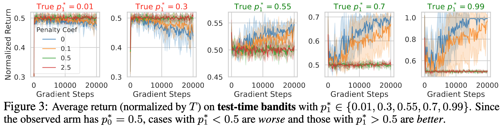
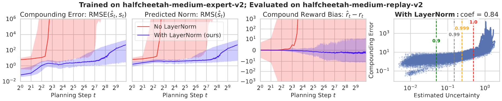
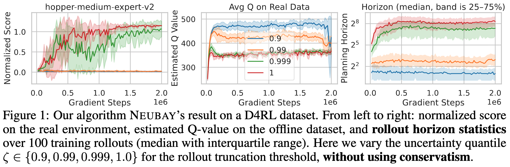
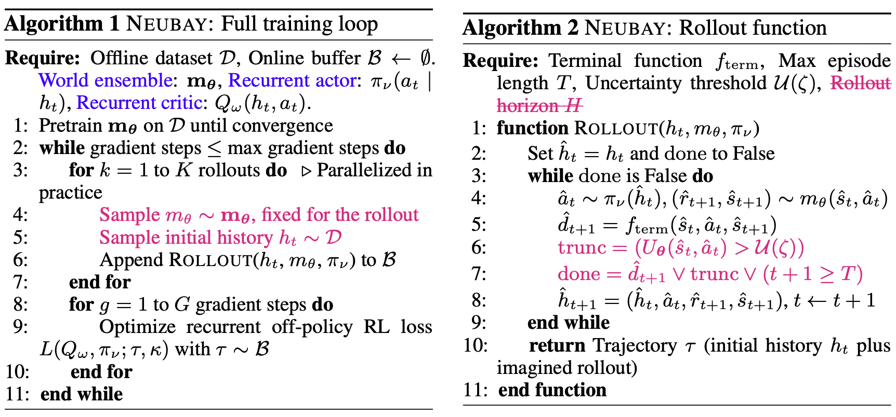

# Long-Horizon Model-Based Offline Reinforcement Learning Without Conservatism

Official code for "Long-Horizon Model-Based Offline Reinforcement Learning Without Conservatism", NeurIPS 2025 Workshop on Aligning Reinforcement Learning Experimentalists and Theorists.

[](https://arxiv.org/abs/2512.04341)


Authors: [Tianwei Ni](https://twni2016.github.io/), [Esther Derman](https://scholar.google.com/citations?user=IBIXZCAAAAAJ&hl=fr), [Vineet Jain](https://vineetjain96.github.io/), [Vincent Taboga](https://tabogavincent.com/), [Siamak Ravanbakhsh](https://siamak.page/), [Pierre-Luc Bacon](https://pierrelucbacon.com/).

## NEUBAY: a first step toward scalable, non-conservative, Bayesian RL

Most offline RL methods rely on conservatism, either by penalizing out-of-dataset actions or by restricting planning horizons. However, we show that **conservatism hurts generalization** with a bandit example (penalty coef > 0):

<p align="center">
  
</p>

Instead, we revisit the Bayesian principle. A **non-conservative Bayesian** agent (penalty = 0) enables **test-time generalization by adaptation**:
- generalizes to better but unseen arm, or
- re-commits to better and seen arm after exploration. 

This corresponds to solving the "epistemic POMDP" [(Ghosh et al., 2022)](https://arxiv.org/abs/2207.02200): construct a POMDP from the offline dataset and train a history-dependent agent on it. Conceptually simple and Bayes-optimal.

It has been challenging to make Bayesian agent practical, as it involves (1) world modeling (2) long-horizon planning (3) recurrent RL. Here, we highlight two key design choices:

(1) **Layer normalization in the world model** can significantly reduce compounding errors: 

<p align="center">
  
</p>

(2) **Adaptive long-horizon planning** can significantly reduce value overestimation, *without introducing conservatism*:

<p align="center">
  
</p>


It succeeds with planning horizons of *several hundred steps*, challenging common wisdom. These yield our practical algorithm, NEUBAY, grounded in the *neu*tral *Bay*esian principle:

<p align="center">
  
</p>

On D4RL and NeoRL benchmarks, NEUBAY performs competitively with state-of-the-art conservative baselines, while avoiding pessimism entirely. We view this as a first step toward **scalable, non-conservative, Bayesian** offline RL.


## Setup

We test our codebase on L40S and A100 GPUs. Our code is written in JAX & [Equinox](https://github.com/patrick-kidger/equinox). To install dependencies:
```bash
conda create -n neubay python=3.10
conda activate neubay
conda env update -f requirements.yml
```
These are mainly standard [D4RL](https://github.com/Farama-Foundation/D4RL) dependencies.

## Pretrained world ensembles

To support reproducibility and simplify agent tuning, we provide pretrained world-model ensembles in the Google Drive folder:

[Download pretrained ensembles](https://drive.google.com/drive/folders/1iklQRg2X1p_NAplkbsZW8-2i6gMMMt4Q?usp=sharing)

After downloading, place the folder under `offline_world/ckpt`. For each dataset, we uploaded six checkpoints for each random seed used in our experiments.

## File structure
- `configs`: configurations for each benchmark and dataset
- `experience`: [tape-based](https://arxiv.org/abs/2402.09900) replay buffer (`agent_buffer.py`), planner (`collector.py`), evaluation on the true MDP (`evaluator.py`), offline data storage for world modeling and history sampling (`world_buffer.py`)
- `memory`: [linear recurrent unit](https://arxiv.org/abs/2303.06349) adapted from [Memoroids](https://arxiv.org/abs/2402.09900)
- `neorl`: adapted from [NeoRL codebase](https://github.com/polixir/NeoRL), included directly to avoid installation
- `offline_world`: world model training and interface for agent interaction
- `online_rl`: online RL algorithms (e.g., [REDQ](https://arxiv.org/abs/2101.05982)) for training with a mixture of offline and synthetic data

## Commands

We run 3 seeds in parallel for acceleration and we recommend setting 
```bash
export XLA_PYTHON_CLIENT_PREALLOCATE=false
``` 
to prevent a single process from allocating all GPU memory. All the training logs will be uploaded to [wandb](https://wandb.ai/site/). 

### Quickstart on the toy example: the bandit dataset

Offline data for the bandit in Section 3 is provided in `offline_world/data`. You may generate your own dataset by `python offline_world/bandit_data.py`. 

```bash
# train your own reward ensemble; skip this if you use pretrained one
export PYTHONPATH=${PWD}:$PYTHONPATH
python offline_world/bandit_ensemble.py --seed 0
# train agent on the reward ensemble with the same seed
python offline_bandit.py seed=0
```
In our experiments, we sweep over `collect.penalty_coef` and `train.enc_lr` to report the best result (see the Appendix). 

### D4RL and NeoRL continuous control benchmarks

First download all datasets by running 
```bash
python get_all_datasets.py
```

Train the world model ensemble (skip if using pretrained checkpoints). We cap training with `ensemble.total_epochs` on some datasets to prevent very long training time. 
```bash
export PYTHONPATH=${PWD}:$PYTHONPATH

# d4rl locomotion (dataset with the same suffix share the same total_epochs)
python offline_world/cont_ensemble.py --config-path=../configs/d4rl_loco --config-name=base dataset_name=hopper-random-v2 ensemble.total_epochs=1200 seed=0
python offline_world/cont_ensemble.py --config-path=../configs/d4rl_loco --config-name=base dataset_name=halfcheetah-medium-replay-v2 seed=0
python offline_world/cont_ensemble.py --config-path=../configs/d4rl_loco --config-name=base dataset_name=walker2d-medium-v2 ensemble.total_epochs=1200 seed=0
python offline_world/cont_ensemble.py --config-path=../configs/d4rl_loco --config-name=base dataset_name=halfcheetah-medium-expert-v2 ensemble.total_epochs=600 seed=0

# neorl locomotion (all use the same total_epochs)
python offline_world/cont_ensemble.py --config-path=../configs/neorl --config-name=base dataset_name=Hopper-v3-low ensemble.total_epochs=1200 seed=0

# adroit
python offline_world/cont_ensemble.py --config-path=../configs/adroit --config-name=base dataset_name=pen-human-v1 seed=0
python offline_world/cont_ensemble.py --config-path=../configs/adroit --config-name=base dataset_name=pen-cloned-v1 ensemble.total_epochs=2400 seed=0
python offline_world/cont_ensemble.py --config-path=../configs/adroit --config-name=base dataset_name=hammer-cloned-v1 ensemble.total_epochs=1200 seed=0

# antmaze (all use the same total_epochs)
python offline_world/cont_ensemble.py --config-path=../configs/antmaze --config-name=base dataset_name=antmaze-umaze-v2 ensemble.total_epochs=1200 seed=0
```

Then train the recurrent agent on the pretrained ensemble. We sweep over `train.critic_enc_lr = train.actor_enc_lr` and `train.real_weight`, and save the best hparams in `configs/<domain>/task`.

```bash
# d4rl locomotion
python offline_cont.py --config-path=configs/d4rl_loco --config-name=base dataset_name=halfcheetah-medium-expert-v2 seed=0
python offline_cont.py --config-path=configs/d4rl_loco --config-name=base task=halfcheetah_medium_expert seed=0 # use the per-task tuned hparams

# neorl locomotion
python offline_cont.py --config-path=configs/neorl --config-name=base dataset_name=Hopper-v3-low seed=0
python offline_cont.py --config-path=configs/neorl --config-name=base task=Hopper_v3_low seed=0

# adroit
python offline_cont.py --config-path=configs/adroit --config-name=base dataset_name=pen-cloned-v1 seed=0
python offline_cont.py --config-path=configs/adroit --config-name=base task=pen_cloned seed=0 

# antmaze
python offline_cont.py --config-path=configs/antmaze --config-name=base dataset_name=antmaze-umaze-v2 seed=0
python offline_cont.py --config-path=configs/antmaze --config-name=base task=umaze seed=0
```

### Ablation study and sensitivity analysis

For the ablation study on the Markov agent (sweeping over `train.real_weight`): 

```bash
# d4rl locomotion
python offline_markov.py --config-path=configs/d4rl_loco --config-name=base_markov dataset_name=halfcheetah-medium-expert-v2 seed=0
# neorl locomotion
python offline_markov.py --config-path=configs/neorl --config-name=base_markov dataset_name=Hopper-v3-low seed=0
# adroit
python offline_markov.py --config-path=configs/adroit --config-name=base_markov dataset_name=pen-cloned-v1 seed=0
# antmaze
python offline_markov.py --config-path=configs/antmaze --config-name=base_markov dataset_name=antmaze-umaze-v2 seed=0
```

For the other studies, based on the best config using `task=<dataset>`, change (defaults in **bold**):
- Uncertainty quantile as rollout threshold: `collect.unc_quantile` in (0.9, 0.99, 0.999, **1.0**)
- Uncertainty penalty as conservative term: `collect.penalty_coef` in (**0.0**, 0.04, 0.2, 1.0, 5.0)
- Ensemble size used in planning (the total ensemble size is fixed at 128): `collect.ensemble_size` in (5, 20, **100**)

### Evaluation on compounding errors

We provide both LayerNorm-ed (`d4rl_loco`, 6 seeds) and non-LayerNormed (`d4rl_loco_no_ln`, 1 seed) world model checkpoints. To compare them: 

```bash
# collect rollouts: trained on hc-random and evaluated on hc-medium-replay
python eval_error.py --config-path=configs/d4rl_loco --config-name=base dataset_name=halfcheetah-random-v2 +eval_dataset=medium-replay-v2 collect.unc_quantile=-1.0
python eval_error.py --config-path=configs/d4rl_loco --config-name=base_no_ln dataset_name=halfcheetah-random-v2 +eval_dataset=medium-replay-v2 collect.unc_quantile=-1.0

# plot rollout stats
python plot_ln.py --train_dataset halfcheetah-random-v2 --eval_dataset medium-replay-v2
```

## Acknowledgements

- https://github.com/patrick-kidger/equinox for the JAX deep learning framework
- https://github.com/proroklab/memoroids for the LRU-based RL implementation in Equinox
- https://github.com/yihaosun1124/OfflineRL-Kit for offline model-based RL implementation in PyTorch
- https://github.com/Howuhh/sac-n-jax for SAC implementation in Equinox
- https://github.com/kwanyoungpark/LEQ and https://github.com/HxLyn3/ADMPO for AntMaze-related configurations
- https://github.com/FanmingL/Recurrent-Offpolicy-RL for recurrent RL configurations on the encoder learning rate 

## Questions?

Please open an issue for technical problems or send an email to Tianwei (twni2016@gmail.com) for questions about the paper.

